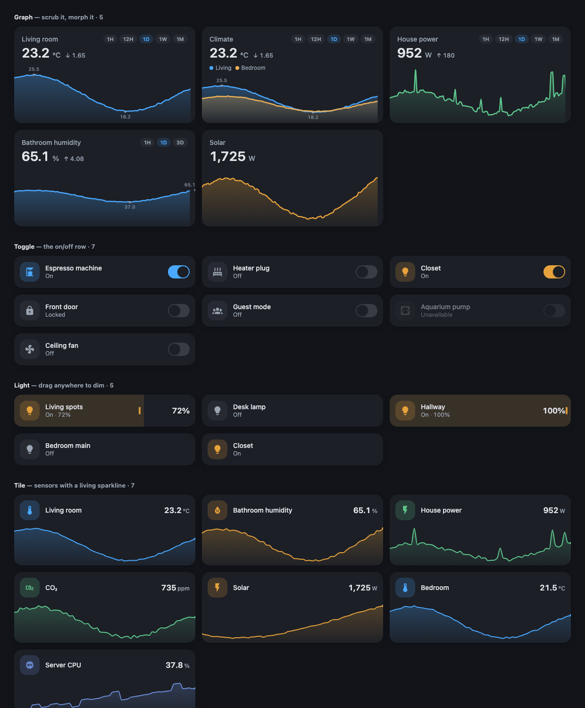

# Silk Card

[한국어](../README.md) | [English](README_en.md) | [中文](README_zh.md) | **日本語**

**Home Assistant のための、バターのように滑らかなカードスイート。**
株アプリのようになぞれるグラフから、カード全体をドラッグして調光するライト、部屋を一行に要約するルームカードまで — 91 種類のカードがひとつのデザイン言語を共有します。設定ゼロでも美しい。



> スクリーンショットでは半分も伝わりません — スクラブとモーフィングは動きが命です。`npm run demo` で触ってみてください。

[](https://github.com/hacs/integration)
[](https://github.com/LeeHueeng/silk-card/releases)
[](../LICENSE)

## なぜ Silk なのか？

既存のグラフカードは二択を迫ります。ミニマルだけど更新が止まっているか、強力だけど YAML の迷宮か。Silk は第三の扉を開きます:

- **タイムスクラブ** — グラフのどこでも押してドラッグすると、その時点の正確な値と時刻が表示されます。金融・ヘルスケアアプリのあの操作感。タッチもマウスも対応。
- **モーフィングする期間切り替え** — `1H / 12H / 1D / 1W / 1M` チップをタップすると、曲線が新しい時間窓へ流れるように変形します。描き直しではなく。
- **デフォルトで美しい** — オーバーシュートのない monotone 曲線、柔らかなグラデーション、脈打つ「現在」ドット、最小/最大マーカー、変化量バッジ。すべてテーマに自動追従。
- **長期間もそのまま動く** — 短い窓は生の履歴を、長い窓は Home Assistant の長期統計を自動的に使用。recorder が古いデータを消しても 1 ヶ月グラフが表示されます。
- **超軽量** — チャートライブラリなしの手書き SVG レンダリング。小さな JS ファイル 1 つだけ。

## 91 種類のカード

タイプはすべて `custom:silk-<名前>-card` パターンです（グラフのみ `custom:silk-card`）。

| カテゴリ | カード |
| --- | --- |
| コントロール | Toggle · Light · Cover · Fan · Climate · Media · Lock · Vacuum · Humidifier · Select · Number · Remote（TV リモコン）· Media Group（スピーカーグループ）· Shutter · Color（カラーホイール） |
| フィジカル | **Rocker**（壁スイッチ）· **Push**（押しボタン）· **Knob**（ダイヤル）· **Fader**（縦スライダー）· **Dial**（Nest 風サーモダイヤル）· **Keypad**（PIN パッド） |
| データ | Graph · Tile · Gauge · Bar · Ring · Status（稼働率）· Progress · Energy · Heatmap（7日×24時間）· Week(日別バー) · Network（↓↑ ミラー）· Compare · Range（日次高低）· Sun（日の出入りアーク） |
| 一目情報 | Weather · Person · Camera · Room · Chips · Battery · Updates · Welcome（挨拶ヘッダー）· Clock · Family（在宅ストリップ）· Device（Zigbee ヘルス）· Count · Air（空気質）· Agenda（予定）· Inbox（通知） |
| アクション・レイアウト | Button · Alarm（キーパッド）· Timer · To-do · Automation · Log · Countdown（D-day）· **Pop-up**（ハッシュ式）· Navbar · Heading · Divider |
| エネルギー | **Power Flow**（太陽光→家→系統のフロー）· **Tariff**（時間帯別料金）· Storage · EV · Water（漏水警報）· Speedtest |
| 屋外・暮らし | Car · Mower · Irrigation · Plant · Forecast（週間）· Moon · UV · Openings · Security · Upkeep · 3D Printer · Appliance |
| コンテナ・ユーティリティ | **Tabs** · **Expander** · **Carousel** · **Launcher** · **Search** · **Assist** · Say(TTS) · **QR**（自作エンコーダ）· Photo · World Clock · Now Playing · Radio |

ギャラリー全体（150+ バリエーション）: [gallery.png](gallery.png) · ローカルで試す: `npm run demo`

## インストール

### HACS（推奨）

1. HACS → 右上の三点メニュー → **Custom repositories**
2. `https://github.com/LeeHueeng/silk-card` をカテゴリ **Dashboard** で追加
3. **Silk Card** を検索してインストール、リロード

### 手動インストール

[最新リリース](https://github.com/LeeHueeng/silk-card/releases)から `silk-card.js` をダウンロードして `config/www/` にコピーし、ダッシュボードリソースとして追加します:

```yaml
url: /local/silk-card.js
type: module
```

## クイックスタート

```yaml
type: custom:silk-card
entity: sensor.living_room_temperature
```

これだけです。ビジュアルエディタを完全サポートしているので、YAML を一切書かなくても使えます。

## オプション

| オプション | 型 | デフォルト | 説明 |
| --- | --- | --- | --- |
| `entity` | string | — | グラフ化するエンティティ（または `entities`） |
| `entities` | list | — | 複数エンティティ。文字列またはオブジェクト（下記参照） |
| `name` | string | friendly name | カードタイトル |
| `icon` | string | — | タイトル横のアイコン（任意） |
| `hours_to_show` | number | `24` | 初期時間窓 |
| `ranges` | list | `[1h, 12h, 1d, 1w, 1m]` | 期間チップ（`Nh`、`Nd`、`Nw`、`Nm`） |
| `range_selector` | boolean | `true` | 期間チップの表示 |
| `fill` | boolean | `true` | 線の下のグラデーション |
| `extremes` | boolean | `true` | 最小/最大マーカー |
| `delta` | boolean | `true` | 変化量バッジ |
| `color` | string | テーマの primary | 線の色（任意の CSS 色） |
| `line_width` | number | `2.5` | 線の太さ |
| `points` | number | `120` | リサンプリング解像度 |
| `unit` | string | エンティティの単位 | 単位の上書き |
| `y_min` / `y_max` | number | 自動 | y 軸の固定範囲 |

### 複数エンティティ

```yaml
type: custom:silk-card
name: Climate
entities:
  - entity: sensor.living_room_temperature
    name: リビング
  - entity: sensor.bedroom_temperature
    name: 寝室
    color: '#f0b357'
hours_to_show: 48
```

凡例チップをタップするとそのシリーズだけが強調され、もう一度タップすると戻ります。

### その他の例

装飾なしのミニマル:

```yaml
type: custom:silk-card
entity: sensor.energy_power
range_selector: false
extremes: false
delta: false
```

湿度用の固定スケール:

```yaml
type: custom:silk-card
entity: sensor.bathroom_humidity
y_min: 0
y_max: 100
```

## ロードマップ

- [ ] 属性のグラフ化（シリーズごとの `attribute:`）
- [ ] エネルギー/消費量センサー向けバーモード
- [ ] ピンチズームによる期間調整
- [ ] 長期間での `sum`/`min`/`max` 統計の選択

Issue や PR を歓迎します。

## 開発

```bash
npm install
npm run watch     # 変更時に自動リビルド（sourcemap 付き）
npm run demo      # ビルド + デモページ http://localhost:5050/demo/
npm run typecheck
```

`demo/` ページはモックの `hass` オブジェクトと生成データでカードを動かします — UI 開発に Home Assistant は不要です。

## ライセンス

[MIT](../LICENSE)
